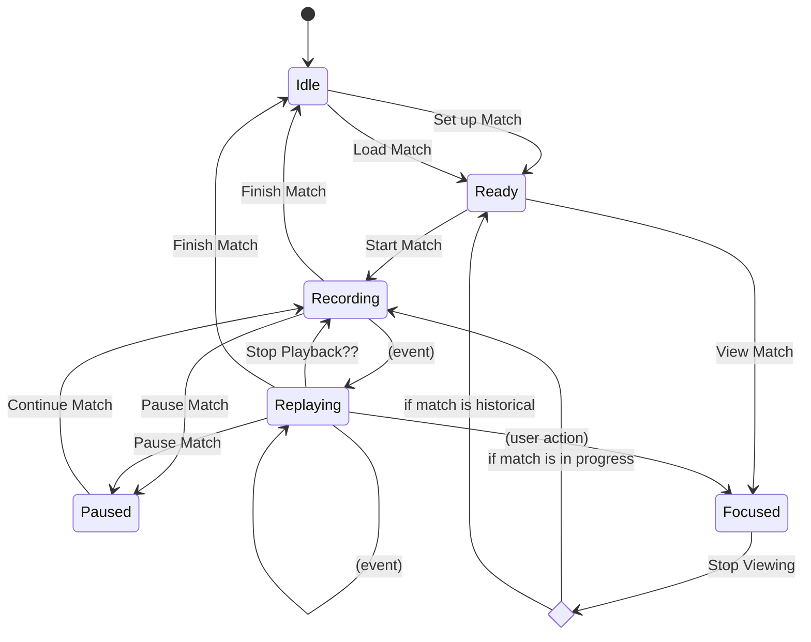

```mermaid
stateDiagram-v2
    state "Idle" as A
    state "Ready" as B
    state "Recording" as C
    state "Paused" as D
    state "Replaying" as E
    state "Focused" as F
    state view_if <<choice>>
    [*] --> A
    A -->B:Set up Match
    A -->B:Load Match
    B -->C:Start Match
    B -->F:View Match
    C -->D:Pause Match
    C -->A:Finish Match
    C -->E:(event)
    D -->C:Continue Match
    E -->D:Pause Match
    E -->C:Stop Playback??
    E -->A:Finish Match
    E -->F:(user action)
    E -->E:(event)
    F -->view_if:Stop Viewing
    view_if -->C:if match is in progress
    view_if -->B: if match is historical
``` 
