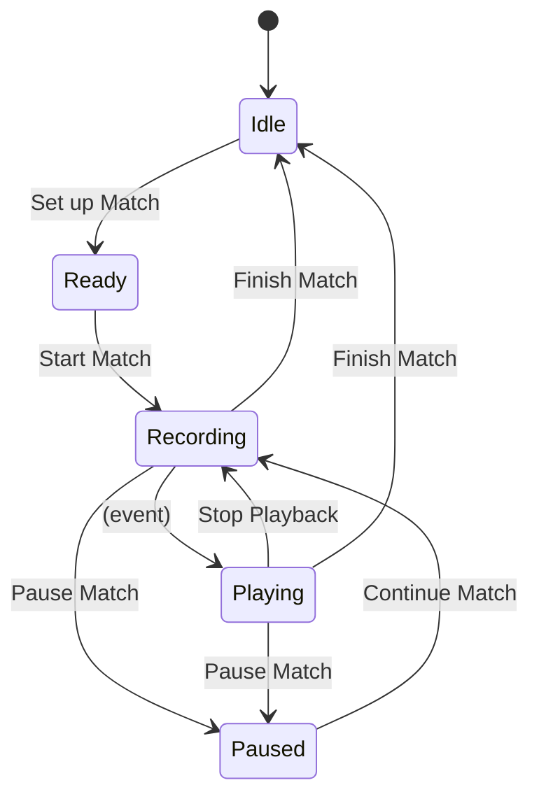

```mermaid
stateDiagram-v2
    state "Idle" as A
    state "Ready" as B
    state "Recording" as C
    state "Paused" as D
    state "Playing" as F
    [*] --> A
    A -->B:Set up Match
    B -->C:Start Match
    C -->D:Pause Match
    C -->A:Finish Match
    C -->F:(event)
    D -->C:Continue Match
    F -->D:Pause Match
    F -->C:Stop Playback
    F -->A:Finish Match
```
